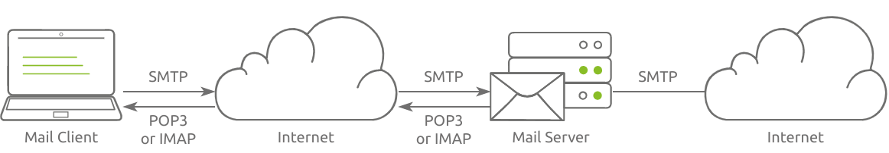

>Each protocol in this will be designed to help us understand what happens on the low level and is usually hidden by an elegant GUI (Graphical User Interface). We will try to  understand what your GUI client is doing under the hood. Our purpose is not to memorize the protocol commands but rather to get a closer look at the protocol while it is working.

## Telnet
>- *The Telnet protocol is an application layer protocol used to connect to a virtual terminal of another computer. Using Telnet, a user can log into another computer and access its terminal (console) to run programs, start batch processes, and perform system administration tasks remotely.*
>- *Telnet protocol is relatively simple. When a user connects, they will be asked for a username and password. Upon correct authentication, the user will access the remote system’s terminal. Unfortunately, all this communication between the Telnet client and the Telnet server is not encrypted, making it an easy target for attackers.*
>- *A Telnet server uses the Telnet protocol to listen for incoming connections on port 23*
>- If A user wants to connect to  a Telnet server. The steps are as follows:
>
>1. **First, he is asked to provide his login name (username).**
>2. **Then, he is asked for the password.**
>3. **Once the system checks his login credentials, he is greeted with a welcome message.**
>4. **And the remote server grants him a command prompt**
>- *Although Telnet gave us access to the remote system’s terminal in no time, it is not a reliable protocol for remote administration as all the data are sent in cleartext.*
>- *Telnet is no longer considered a secure option, especially that anyone capturing your network traffic will be able to discover your usernames and passwords, which would grant them access to the remote system. The secure alternative is SSH (Secure Shell) protocol.*
## Hyper Text Transfer Protocol
>- *Hypertext Transfer Protocol (HTTP) is the protocol used to transfer web pages. Your web browser connects to the webserver and uses HTTP to request HTML pages and images among other files and submit forms and upload various files. Anytime you browse the World Wide Web (WWW), you are certainly using the HTTP protocol.*
>- *HTTP sends and receives data as cleartext (not encrypted); therefore, you can use a simple tool, such as Telnet (or Netcat), to communicate with a web server and act as a “web browser”. The key difference is that you need to input the HTTP-related commands instead of the web browser doing that for you.*
>- *We can use `telnet` instead of a web browser to request a file from the webserver.*
>- *We need an HTTP server (webserver) and an HTTP client (web browser) to use the HTTP protocol. The web server will “serve” a specific set of files to the requesting web browser.*

>- Three popular choices for HTTP servers are:

- **[Apache](https://www.apache.org/)**
- **[Internet Information Services (IIS)](https://www.iis.net/)**
- **[nginx](https://nginx.org/)**
>- Apache and Nginx are free and open-source software. However, IIS is closed source software and requires paying for a license.

>- There are many web browsers available. The most popular web browsers are:
- **Chrome by Google**
- **Edge by Microsoft**
- **Firefox by Mozilla**
- **Safari by Apple.**

## File Transfer Protocol
>- *File Transfer Protocol (FTP) was developed to make the transfer of files between different computers with different systems efficient.*
>- *FTP also sends and receives data as cleartext; therefore, we can use Telnet (or Netcat) to communicate with an FTP server  and act as an FTP client or use actual ftp client by typing ftp and giving ip.*
>- *FTP servers listen on port 21 by default.*
>- *To connect we need to provide user name and password and we should be logged in.*
>- *FTP servers and FTP clients use the FTP protocol. There are various FTP server software that you can select from if you want to host your FTP file server.* *Examples of FTP server software include:*

1. [vsftpd](https://security.appspot.com/vsftpd.html)
2. [ProFTPD](http://www.proftpd.org/)
3. [uFTP](https://www.uftpserver.com/)
>- *For FTP clients, in addition to the console FTP client commonly found on Linux systems, you can use an FTP client with GUI such as [FileZilla](https://filezilla-project.org/). Some web browsers also support FTP protocol.*
>- *Because FTP sends the login credentials along with the commands and files in cleartext, FTP traffic can be an easy target for attackers.*
## Simple Mail Transfer Protocol
>- *Email is one of the most used services on the Internet. There are various configurations for email servers; for instance, you may set up an email system to allow local users to exchange emails with each other with no access to the Internet*. However, we will consider the more general setup where different email servers connect over the Internet.
- Email delivery over the Internet requires the following components:
1. **Mail Submission Agent (MSA)**
2. **Mail Transfer Agent (MTA)**
3. **Mail Delivery Agent (MDA)**
4. **Mail User Agent (MUA)**
>- The above four terms may look cryptic, but they are more straightforward than they appear.
- Email needs to go through  five steps to in order to  reach the recipient’s inbox
1. ***A Mail User Agent (MUA), or simply an email client, has an email message to be sent. The MUA connects to a Mail Submission Agent (MSA) to send its message.***
2. ***The MSA receives the message, checks for any errors before transferring it to the Mail Transfer Agent (MTA) server, commonly hosted on the same server.***
3. ***The MTA will send the email message to the MTA of the recipient. The MTA can also function as a Mail Submission Agent (MSA).***
4. ***A typical setup would have the MTA server also functioning as a Mail Delivery Agent (MDA).***
5. ***The recipient will collect its email from the MDA using their email client.***
#### Analogy
>		Consider the following analogy in order to understand how email reaches recipient's inbox:-

1. ***You (MUA) want to send postal mail.***
2. ***The post office employee (MSA) checks the postal mail for any issues before your local post office (MTA) accepts it.***
3. ***The local post office checks the mail destination and sends it to the post office (MTA) in the correct country.***
4. ***The post office (MTA) delivers the mail to the recipient mailbox (MDA).***
5. ***The recipient (MUA) regularly checks the mailbox for new mail. They notice the new mail, and they take it.***
#### SMTP
- *Simple Mail Transfer Protocol (SMTP) is used to communicate with an MTA server. Because SMTP uses cleartext, where all commands are sent without encryption, we can use a basic Telnet client to connect to an SMTP server and act as an email client (MUA) sending a message.*
- *SMTP server listens on port 25 by default*
## Post Office Protocol (POP 3)
>- *Post Office Protocol version 3 (POP3) is a protocol used to download the email messages from a Mail Delivery Agent (MDA) server,*
 - *The mail client connects to the POP3 server, authenticates, downloads the new email messages before (optionally) deleting them.*
 >- *A user can connect to a POP3 server using a Telnet client on the default POP3 port, which is port 110. To access email messages, the user must first authenticate by entering their username and password.*
 - *Commands are sent in cleartext in pop3 protocol*
 >- *Using Telnet to connect and authenticate with the POP3 server is sufficient to retrieve email messages. However, because the username and password are transmitted in plain text, anyone monitoring the network traffic can potentially intercept and steal the login credentials.*
 - *In general, your mail client (Mail User Agent or MUA) connects to the POP3 server (Mail Delivery Agent or MDA), authenticates, and downloads your email messages. While the process is handled through a user-friendly interface, the client is still issuing the same underlying POP3 commands behind the scenes.*
 >- *By default, a mail client deletes messages from the server after downloading them via POP3. This behavior can be changed in the client’s settings if you want to keep a copy of the emails on the server—for example, to access them later from another device or client. However, using multiple clients to access the same email account over POP3 can be inconvenient, as it becomes difficult to keep track of read and unread messages. To maintain synchronization across devices, it's better to use a protocol like IMAP.*

## Internet Message Access Protocol (IMAP)
>- Internet Message Access Protocol (IMAP) is more sophisticated than POP3
>- IMAP makes it possible to keep your email synchronized across multiple devices (and mail clients). In other words, if you mark an email message as read when checking your email on your smartphone, the change will be saved on the IMAP server (MDA) and replicated on your laptop when you synchronize your inbox.
>- IMAP works on port 143 by default
>- IMAP sends the login credentials in cleartext.. Anyone watching the network traffic would be able to know Frank’s username and password.

## Secure Shell (SSH)
>- *Secure Shell (SSH) was created to provide a secure way for remote system administration. In other words, it lets you securely connect to another system over the network and execute commands on the remote system.*
>- *Put simply, the “S” in SSH stands for secure, which can be summarized simply as:*
1. **You can confirm the identity of the remote server**
2. **Exchanged messages are encrypted and can only be decrypted by the intended recipient**
3. **Both sides can detect any modification in the messages**
>*The above three points are ensured by cryptography. In more technical terms, they are part of confidentiality and integrity, made possible through the proper use of different encryption algorithms.*
>To use SSH, you need an SSH server and an SSH client. The SSH server listens on port 22 by default. The SSH client can authenticate using:

- **A username and a password**
- **A private and public key (after the SSH server is configured to recognize the corresponding public key)**
>*On Linux, macOS, and MS Windows builds after 2018, you can connect to an SSH server using the following command `ssh username@MACHINE_IP`*
>This command will try to connect to the server of IP address `MACHINE_IP` with the login name `username`. If an SSH server is listening on the default port, it will ask you to provide the password for `username`. Once authenticated, the user will have access to the target server’s terminal.
 SSH is very reliable for remote administration because our username and password were sent encrypted; moreover, all commands we execute on the remote system will be sent over an encrypted channel.
 Note that if you connect to system for first time, we will need to confirm the fingerprint of the SSH server’s public key to avoid man-in-the-middle (MITM) attacks
 We can use SSH to transfer files using SCP (Secure Copy Protocol) based on the SSH protocol
## SSL/TLS Protocol
>*Secure Socket Layer (SSL) and Transport Layer Security (TLS) are protocols used to encrypt data exchanged between a client, such as a web browser, and a server. Consider SSL/TLS as a wrapper that encrypts various communication protocols, such as HTTP and FTP, to create HTTPS and FTPS. SSL is not commonly used nowadays as TLS has been gradually replacing it.*
#### Work Flow
>SSL/TLS handshake is performed to encrypt the communication between client and server through the following steps:

1. **Client Hello Message: The client sends a hello message to the server; it includes the client TLS version and the cypher suite that the client supports, in addition to random bytes.**
2. **Server Hello Message: The server responds with a hello message, highlighting its certificate, chosen cypher suite and random bytes.**
3. **Authentication: The client authenticates the server’s certificate through the certificate authority that issued it. For example, when we visit [Google](https://www.google.com/), Google shares its certificate. The received certificate is verified by our browser, which is pre-installed with the certificates of various certificate authorities.**
4. **Premaster Secret: The client encrypts random bytes with the server’s public key. (The client retrieves the public key from the server’s certificate.)**
5. **Decryption of Premaster: The server decrypts the premaster with its private key.**
6. **Session Keys Generated: The client and the server generate session keys based on client random bytes, random server bytes and premaster secret. Both will arrive at the same results; this session key is not transmitted, and encryption and decryption are based on this key.**
7. **Ready Messages: The client and server send a “finished” message using the session key to indicate that the session is ready for transmission. The client and server are now ready to exchange messages over SSL/TLS encrypted connection.**
>*TLS is a wrapper that encrypts communication of communication protocols. It has port numbers for various protocols, such as 443 for HTTPS and 990 for FTPS.*

## SOCKS 5 Protocol
#### Technical Overview
Socket Secure (SOCKS) is a proxy protocol for data exchange through a delegate server (SOCKS5 proxy). It is used to secure application layer protocols. For example, the Squid server implements the SOCKS5 protocol to transfer data via the HTTP protocol.
#### Workflow
Consider a scenario when user A wants to connect with client B over the Internet, but a firewall is between them. The following handshake steps are involved:

- **Client Initiation**
    - Client A connects with the SOCKS5 proxy and sends the first byte (0x05) to the proxy where “5” is the SOCKS version.
    - Client A sends a second byte (0x01). One means authentication is supported.
    - Client A sends the third byte (0x00, 0x01, 0x02, or 0x03); these bytes denote the supported authentication methods and can be of variable length.
- **SOCKS5 Proxy Reply**
    - The proxy sends back a second byte, which is the chosen authentication method by the proxy server.
    - After the initiation packet, client A sends the request packet, which includes BHOST & BPORT numbers.
    - The successful session is established between client A and the proxy. The same steps are involved in the association of client B with the proxy.
- **Data Transfer**
    - After successfully associating both clients with a proxy server, both clients can exchange data and share information that will be routed through the proxy server.

## Open PGP
#### Background
When the first email was sent in 1971, we had a different cyber security landscape. Email protocols such as SMTP and POP3 are designed to send emails in cleartext. The same applies to IMAP, which allows synchronizing your mailbox with that on the server. All these protocols make your email no different than an exposed postcard open for everyone to see as it is handed from one server to another.

The image below shows a simplified example where a user uses an email client to send their email over SMTP and receive new email messages over POP3 or IMAP. The mail server uses SMTP to deliver the user’s email messages to the intended recipient. Since all these protocols use clear text, an intruder can read the email messages as they travel across the Internet.

  

With the increased popularity of web-based email, users started to connect to a web server to read and compose their email messages. The image below shows an email message as it is written using a web browser. The web server, in turn, uses a mail server to send composed email messages and receive incoming ones. The connection was over HTTP, which meant that the same security issues related to confidentiality and integrity persisted.

However, as service providers realized the need for SSL/TLS to secure web traffic, HTTPS became the new standard. Consequently, most web-based email systems migrated to HTTPS, causing the traffic between the web browser and the web server to be encrypted. However, the email traffic is not necessarily encrypted between the web server and the mail server(s). The web server and mail servers can read the contents of the messages; moreover, mail servers might use SMTP to transfer the messages, which means that email messages will traverse the Internet in cleartext.

Eventually, SSL/TLS started to find their way into all email protocols. SMTP, POP3, and IMAP became SMTPS, POP3S, and IMAPS, respectively. The “S” added to the protocol name refers to **secure**, indicating the addition of SSL/TLS on top of the existing protocol.

The image below shows a simplified example where a mail client uses SMTPS to send an email and uses POP3S or IMAPS to receive an email. The result is that email is sent encrypted between the client and the server; however, the mail server can read the email message contents.

*The addition of SSL/TLS has dramatically enhanced the security of email messages. However, we must still trust the mail servers across the way. If this is not something you are comfortable with, you need to consider a standard such as OpenPGP.* 
*PGP (Pretty Good Privacy) is an encryption program created by Phil Zimmerman.*

#### Over View
- *OpenPGP is an **open standard** for signing and encrypting files and email messages and is detailed in [RFC 4880](https://www.rfc-editor.org/rfc/rfc4880). GnuPG (Gnu Privacy Guard), or simply GPG, is a free and open-source implementation of the OpenPGP standard. In brief, GnuPG allows you to sign and encrypt your data and communications.*
- *GnuPG can easily integrate with your mail client to seamlessly sign, encrypt and decrypt email messages. Email messages encrypted using GnuPG (i.e., following OpenPGP standard) be only readable by the intended recipient. In other words, no one, including the mail servers, can read the contents of the messages except the intended recipient*
- *When used with email, GnuPG requires each user to generate a key pair: a private key and a public key. In simple terms, the sender’s private key is used for signing, while the recipient’s public key is used for encryption. From the recipient’s perspective, the sender’s public key is used to check the signature, while the recipient’s private key is used for decryption.*
- *OpenPGP implementations, such as GnuPG, offer a great solution to protect the confidentiality and integrity of email message contents. However, this does not include email message headers.*
- *To use OpenPGP, both parties need to generate a key pair using the command `gpg --gen-key`. This command will ask the user to provide their name and email address and create a private and public key. The private key should be stored securely, while the public key should be shared with the other parties we wish to communicate securely with.*
- *Encrypting using `gpg` created the following message that can be sent seamlessly with an email client.*
## Server Message Block 
- **SMB (Server Message Block) is a network file sharing protocol.**
- **SMB is a network file sharing protocol used primarily in Windows environments, but also supported on macOS and Linux (e.g., via Samba).**
- **It allows users and applications to read, write, and share files and printers over a network.**
- **SMB enables users to access files on remote systems as if they were on the local machine.**
- **The protocol supports user authentication and access control through mechanisms like NTLM and Kerberos.**
- **SMB is used for network browsing, allowing users to discover shared folders, printers, and devices on the local network.**
- **Sessions are maintained between client and server for continuous communication.**
- **SMB 1.0 (also known as CIFS) is outdated and vulnerable to security threats, and is often disabled in modern systems.**
- **SMB 2.0 and 2.1 introduced performance improvements and reduced protocol overhead.**
- **SMB 3.x (introduced with Windows 8/Server 2012) added support for encryption, better performance, and fault tolerance.**
- **The protocol typically uses TCP port 445 (and port 139 in older versions).**
- **SMB traffic should be restricted to trusted networks to prevent unauthorized access and mitigate threats.**
- **Common use cases include file servers, network-attached storage (NAS), printer sharing, and domain-based user profile management.**
