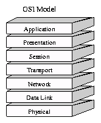
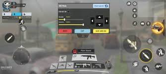

# OSI Model

The **OSI** model (Open Systems Interconnection Model) is a foundational model used in networking. It provides a framework for how devices communicate across a network, layer by layer.

---

## 🖼 OSI Model Layers Diagram

> Have you ever wondered what happens when you fire a shot in Call of Duty and it hits a player halfway across the world? How does your action become data and travel through the internet so fast? The OSI Model helps explain this journey.

---

## Seven Layers Of OSI Model

### **Layer 7 – Application Layer**
The layer you interact with directly as a user.  
🎮 *“You tap the fire button.”*

### **Layer 6 – Presentation Layer**
Formats, compresses, and encrypts data.  
COD compresses your shot data and mic audio here.

### **Layer 5 – Session Layer**
Creates and maintains the connection (session) with the game server.

### **Layer 4 – Transport Layer**
Splits your data into smaller chunks using either:
- **TCP** for reliability (e.g. chat, login)
- **UDP** for speed (e.g. movement/shooting)

COD uses **UDP** for real-time gameplay.

### **Layer 3 – Network Layer**
Adds the **IP address** — determines the best path to the destination.

### **Layer 2 – Data Link Layer**
Adds the **MAC address** — identifies your device on the local network.

### **Layer 1 – Physical Layer**
Converts all data into signals (Wi-Fi waves, cables, fiber) to be transmitted.

---

## 🎮 COD HUD Visualization

This shows the practical output of your action once the server processes your data and sends the result back to your game client.

---

## ✅ Final Recap Table

| Layer Number | Layer Name       | Function                                    | Example Protocols              |
|--------------|------------------|---------------------------------------------|--------------------------------|
| Layer 7      | Application       | User-facing interaction                     | HTTP, FTP, DNS, SMTP           |
| Layer 6      | Presentation      | Encoding, compression, encryption           | JPEG, PNG, TLS                 |
| Layer 5      | Session           | Session creation & management               | NFS, RPC                       |
| Layer 4      | Transport         | Reliable/unreliable transmission (TCP/UDP)  | TCP, UDP                       |
| Layer 3      | Network           | Routing and addressing                      | IP, ICMP                       |
| Layer 2      | Data Link         | Local delivery with MAC addresses           | Ethernet, Wi-Fi                |
| Layer 1      | Physical          | Electrical/optical/wireless signal transfer | Cables, radio, fiber optics    |

---

### 📢 Disclaimer

This content is for educational purposes only and is not affiliated with or endorsed by Call of Duty or any mentioned platforms.  
**© Property of: Alpha Bey**
